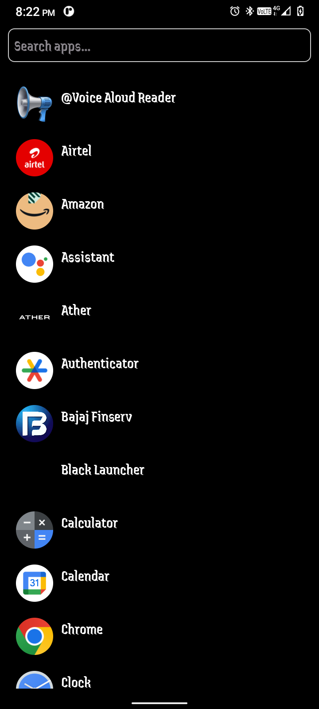
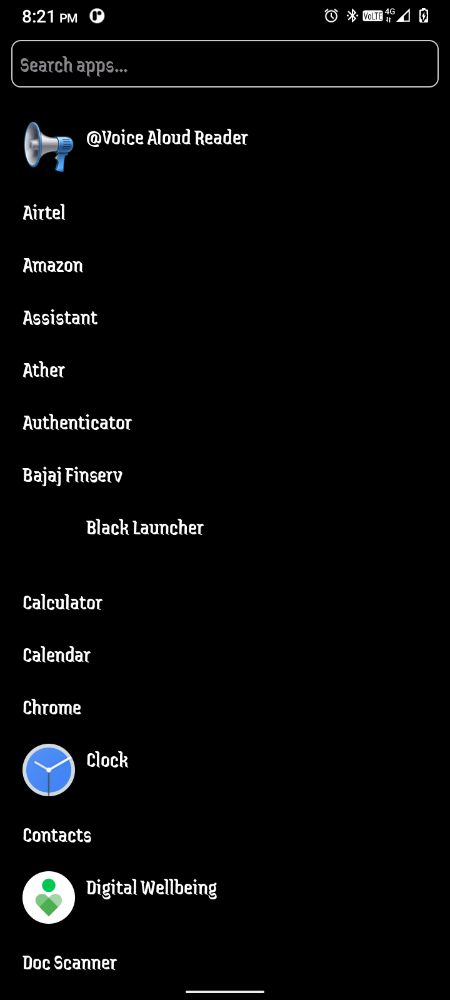
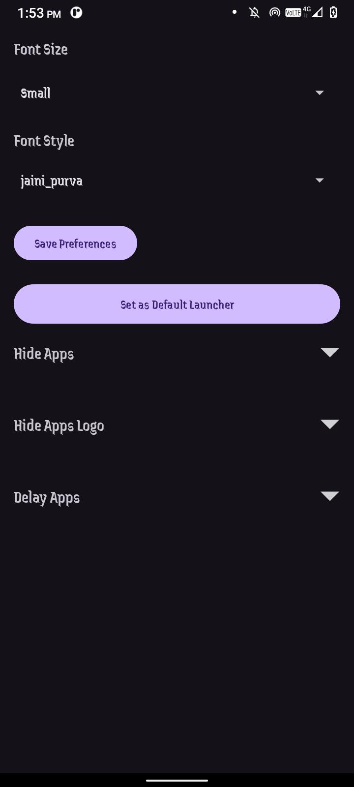
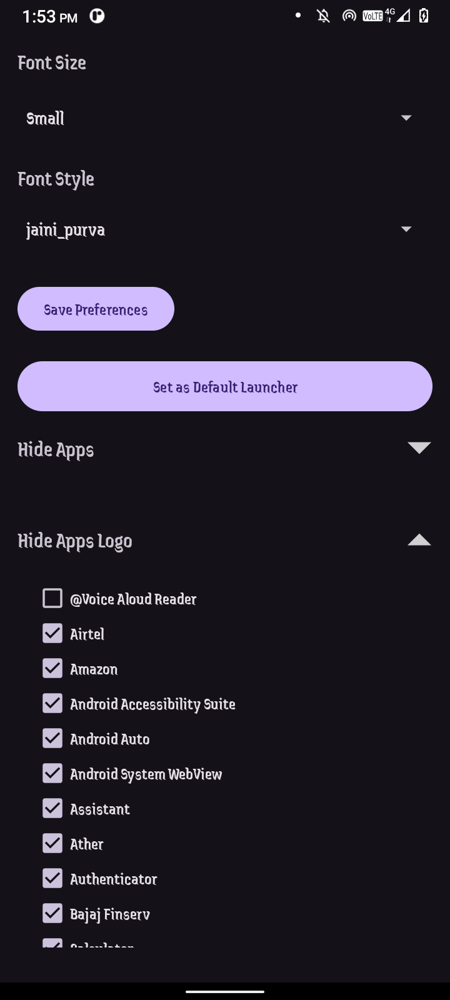

# BlackLauncher

BlackLauncher is a minimalist and customizable Android launcher designed for simplicity and productivity. With a sleek black-themed UI, it offers essential features such as font customization, app hiding, and the ability to set it as the default launcher. This project aims to provide a lightweight launcher with user-centric functionality.

✶ Made with minimalism in mind.✶
✶ Stay focused using the Black launcher.✶
✶ Bit Launcher helps you use your Phone less and live in the moment✶

## Features

- **Minimalist Design:**
  - Focus on simplicity and productivity.
- **Hide Apps:**
  - Easily hide specific apps from appearing on the launcher.
- **Hide Apps Logo's:**
  - Easily hide specific app's Logo only from appearing on the launcher.
- **Set as Default Launcher:**
  - Convenient button to set BlackLauncher as the default launcher.
- **Dynamic UI:**
  - Automatically fetches and displays installed apps.
  - Dynamic checkboxes for hiding apps and apps logo.
  - Collapsible "Hide Apps" and "Hide Apps Logo" section for a cleaner UI in settings.
- **Save your battery:**
  - Use our true black background to significantly preserve your battery (if your phone has an AMOLED screen).
- **Font Customization:**
  - Change font size and style from the settings.
- **Easy set up:**
  - Our guided process helps you get BitLauncher set up in no time.

We respect your privacy. We don't track personally identifiable data and allow for several ways to make your experience even more private.

## Screenshots









## Installation

1. Clone this repository:
   ```bash
   git clone https://github.com/KhemnarMayuresh/Black-Launcher.git
   ```
2. Open the project in Android Studio.
3. Build and run the app on an Android device or emulator.

## Usage

1. Open the app and navigate to the settings page.
2. Customize the font size and style using the dropdown menus.
3. Use the "Hide Apps" section to toggle visibility of specific apps.
4. Click "Set as Default Launcher" to set BlackLauncher as your primary launcher.

## Code Structure

### Key Files

- `MainActivity.java`:
  - The main screen of the launcher.
- `SettingsActivity.java`:
  - Handles customization and settings management.
- `AppUtils.java`:
  - Utility class for fetching installed apps and related operations.
- `AppModel.java`:
  - Data model representing app details.

### Layouts

- `activity_main.xml`:
  - Defines the layout for the main launcher screen.
- `activity_settings.xml`:
  - Defines the layout for the settings page.

## Customization

- **Font Options:**
  - Add more font sizes and styles by updating `res/values/arrays.xml`.
- **Icons:**
  - Replace default icons for a more personalized experience.

## Contributing

Contributions are welcome! To contribute:

1. Fork this repository.
2. Create a new branch:
   ```bash
   git checkout -b feature-name
   ```
3. Commit your changes:
   ```bash
   git commit -m "Add feature-name"
   ```
4. Push to the branch:
   ```bash
   git push origin feature-name
   ```
5. Open a pull request.

## License

This project is licensed under the MIT License. See the `LICENSE` file for details.

## Contact

For any inquiries or suggestions, feel free to reach out:
- **Email:** khemnarmayuresh19@gmail.com
- **GitHub:** [KhemnarMayuresh](https://github.com/KhemnarMayuresh)

