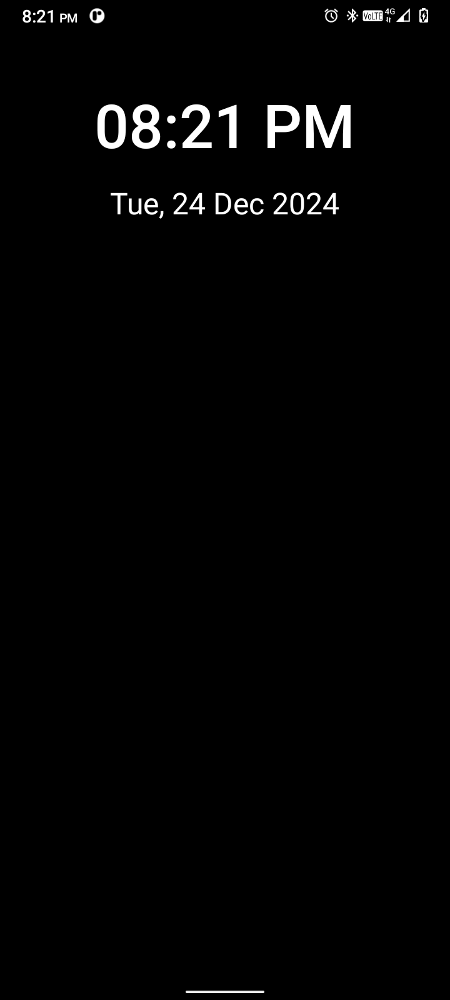
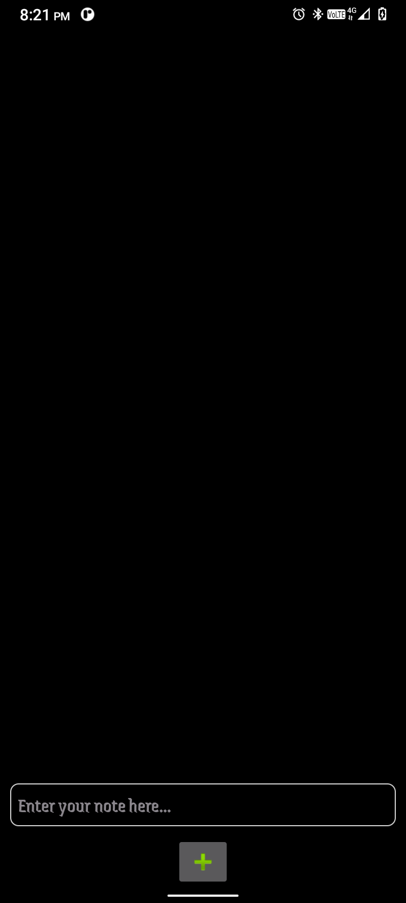
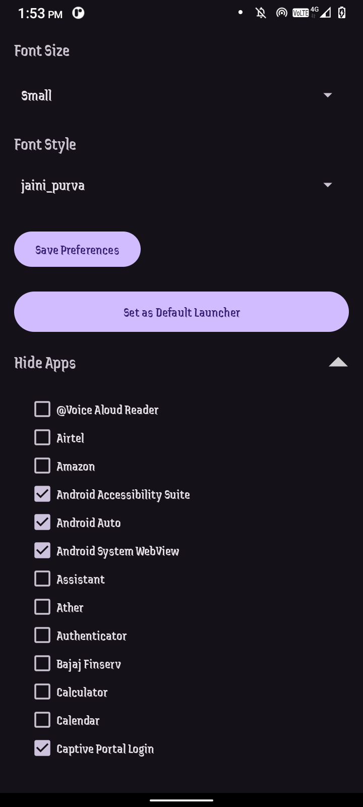
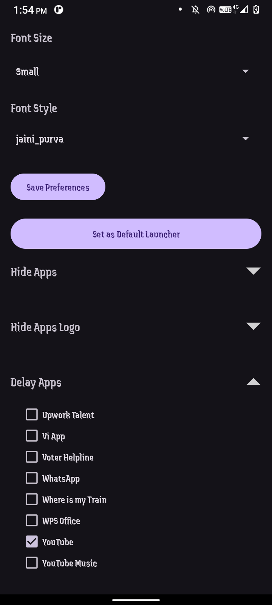

# Simply Launcher

Simply Launcher is a minimalist and customizable Android launcher designed for simplicity and productivity. With a sleek black-themed UI, it offers essential features such as font customization, app hiding, and the ability to set it as the default launcher. This project aims to provide a lightweight launcher with user-centric functionality.

**✦ Made with minimalism in mind.**

**✦ Stay focused using the BlackLauncher.**

**✦ BlackLauncher helps you use your phone less and live in the moment.**

## Features

### Minimalist Design
- Focused on simplicity and productivity with a clean and distraction-free interface.

### App Customization
- **Hide Apps**: Easily hide specific apps from appearing on the launcher.
- **Hide App Logos**: Hide specific app logos while keeping app functionality intact.

### Settings and Personalization
- **Set as Default Launcher**: Convenient button to set BlackLauncher as the default launcher.
- **Font Customization**: Change font size and style from the settings menu.

### Dynamic UI
- Automatically fetches and displays installed apps.
- Dynamic checkboxes for managing hidden apps and logos.
- Collapsible "Hide Apps" and "Hide App Logos" sections for a cleaner settings interface.

### Performance and Efficiency
- **Battery Optimization**: Utilizes a true black background to conserve battery on AMOLED screens.
- Lightweight and optimized for seamless performance on various devices.

### Easy Setup
- Guided setup process to get BlackLauncher running quickly.

### Privacy-Focused
- Does not track personally identifiable data, prioritizing user privacy.
We respect your privacy. We don't track personally identifiable data and allow for several ways to make your experience even more private.

## Screenshots

<div style="display: flex; flex-wrap: nowrap; gap: 10px; overflow-x: auto;">
  
  
  
  
  
  
  
  
</div>

## Installation

1. Clone this repository:
   ```bash
   git clone https://github.com/KhemnarMayuresh/Black-Launcher.git
   ```
2. Open the project in Android Studio.
3. Ensure you have the necessary dependencies (Java JDK, Gradle).
4. Build and run the app on an Android device or emulator.

## Usage

1. Open the app and navigate to the settings page.
2. Customize the font size and style using the dropdown menus.
3. Use the "Hide Apps" section to toggle visibility of specific apps.
4. Click "Set as Default Launcher" to set BlackLauncher as your primary launcher.

## Code Structure

The codebase is organized into key components to ensure modularity and ease of maintenance.

### **Activities**

- `MainActivity.java`:
  - The main screen of the launcher, responsible for displaying apps and navigation.
- `SettingsActivity.java`:
  - Handles customization and user preferences.

### **Utilities**

- `AppUtils.java`:
  - Provides helper methods for fetching installed apps and managing app visibility.

### **Models**

- `AppModel.java`:
  - Data model representing app details (e.g., name, icon, visibility status).

### **Adapters**

- `AppListAdapter.java`:
  - Manages the display of app lists in RecyclerViews.

### **Layouts**

- `activity_main.xml`:
  - Defines the layout for the main launcher screen, including app icons and navigation.
- `activity_settings.xml`:
  - Defines the layout for the settings page, including toggles for hiding apps and customizing fonts.
- `list_item_app.xml`:
  - Layout for individual app items in the app list.

### **Resources**

- **Drawables:**
  - Icons and background assets.
- **Values:**
  - `strings.xml`:
    - Contains user-visible text.
  - `colors.xml`:
    - Defines the color scheme.
  - `arrays.xml`:
    - Lists font sizes and styles for customization.

### **Manifests**

- `AndroidManifest.xml`:
  - Declares app components, permissions, and launcher settings.

### **Settings Storage**

- SharedPreferences:
  - Used for storing user settings such as hidden apps and font preferences.

## Customization

- **Font Options:**
  - Add more font sizes and styles by updating `res/values/arrays.xml`.
- **Icons:**
  - Replace default icons in the `res/drawable` directory for a personalized look.

## Contributing

Contributions are welcome! To contribute:

1. Fork this repository.
2. Create a new branch:
   ```bash
   git checkout -b feature-name
   ```
3. Commit your changes:
   ```bash
   git commit -m "Add feature-name"
   ```
4. Push to the branch:
   ```bash
   git push origin feature-name
   ```
5. Open a pull request.

## License

This project is licensed under the MIT License. See the `LICENSE` file for details.


## Future Features

- **Weather Integration**: Display weather on the home screen (optional).
- **Favorites/Quick Access**: Pin favorite apps for easy access.
- **Gesture Support**: Add gesture-based navigation and shortcuts.
- **Widget Support**: Limited support for widgets like calendars, tasks, and weather.
- **Font and Icon Size Adjustment**: Enable resizing for accessibility and aesthetic preferences.
- **To-Do List Integration**: Minimal task reminders or lists on the home screen.
- **Backup and Restore**: Save settings and layouts for easy restoration.
- **Offline/Do Not Disturb Toggle**: Quick toggle and indicator for offline or silent mode.

## Contact

For any inquiries or suggestions, feel free to reach out:
- **Email**: [khemnarmayuresh19@gmail.com](mailto:khemnarmayuresh19@gmail.com)
- **GitHub**: [KhemnarMayuresh](https://github.com/KhemnarMayuresh)